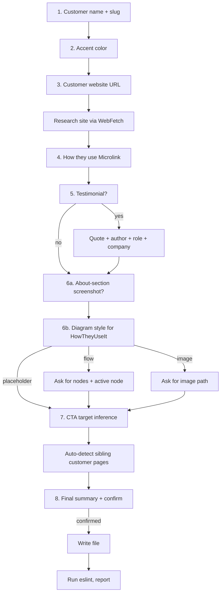

# Customer Story

Build a new customer use-case landing page at `src/pages/customers/<slug>.js`.

The goal is not generic "story" copy. The goal is a repo-native page that:

- mirrors the structure of `src/pages/customers/example.js` exactly
- swaps the default teal accent for a customer-specific accent only when the user asks
- researches the customer honestly from their website (no invented metrics, no invented features)
- automatically links the new page into the existing customer-stories carousel
- routes the CTA to the most relevant Microlink product page based on the use case

## Read First

Before planning or editing, read these in order:

1. `src/pages/customers/example.js` — the canonical structural reference.
2. `.cursor/skills/customer-story/references/template.md` — the literal template with `{{TOKEN}}` placeholders.
3. `.cursor/skills/customer-story/references/accent-colors.md` — allowed ramps and the `ACCENT` shape.
4. `.cursor/skills/customer-story/references/cta-routing.md` — use-case → product href mapping.
5. `src/pages/feature/proxy.js` — only when the user picks the **flow** diagram style; copy `Node` / `NodeActive` / `NodeLabel` / `NodeSub` / `Arrow` primitives from lines 484–693.
6. `AGENTS.md` — repo-wide style rules (`theme({...})`, design tokens, accessibility).

## Hard Rules

These are non-negotiable.

- Never write the file before completing all steps below and getting explicit user confirmation in the final summary step.
- Never invent customer claims, metrics, headcount, funding, scale, or product features. If the customer's website doesn't say it, ask the user.
- Never ship placeholder-only copy. By the end, every `{{TOKEN}}` MUST be replaced with concrete content (or the corresponding section MUST be removed).
- Never use a slug of `example`, an empty slug, or a slug that already exists in `src/pages/customers/`. If the user requests a slug that collides, stop and ask.
- Never use the `pink` / `secondary` / `pinky` / `pinkest` accent — those are reserved for `src/pages/feature/*.js`. Customer pages MUST use one of the ramps in `references/accent-colors.md`.
- Never inline accent token strings (`'teal7'` etc.) outside the `ACCENT` constant. All consumers read from `ACCENT.text` / `ACCENT.bgSoft` / `ACCENT.bgEdge` / `ACCENT.highlight`.
- Never leave dead code. If the user says "no testimonial", remove the entire `Testimonial` component, all its styled components, the comment block, AND the `<Testimonial />` render line. Same rule for `MoreCustomers` when fewer than 2 sibling pages exist.
- Never add or modify FAQ structured data. Customer pages do not have FAQ sections.
- Never run prettier, prettier-standard, or any repo-level formatter. This repo's formatter can rewrite unrelated files. Verification is `npx eslint src/pages/customers/<slug>.js` only.
- Never modify `src/pages/customers/example.js`. It is the live template.
- Never edit `.cursor/skills/customer-story/references/*.md` as part of running the skill. Only the SKILL author maintains those.

## Workflow

The skill is a strict, single-question-at-a-time conversation. Do NOT ask multi-part questions. Do NOT proceed to the next step until the current step's answer is captured.



### Step 1 — Customer name + slug

Ask: "What's the customer's name?"

After the user answers:

- Compute the default slug as `kebab-case(customer.toLowerCase())`. Strip non-alphanumeric characters except `-`. Collapse multiple dashes.
- Read `src/pages/customers/` to verify the slug is not already taken.
- If `<slug>.js` already exists OR `<slug>` is `example`, propose a different slug (e.g. `<slug>-2`) and ask the user to confirm or override.
- Echo back: "Slug will be `customers/<slug>`. Confirm or provide an alternative."

Wait for confirmation before moving on.

### Step 2 — Accent color

Ask: "What accent color? (default: teal — also available: blue, cyan, green, orange, yellow). Skip pink/red — those are reserved for feature pages."

If the user gives a brand name or hex, map it to the closest allowed ramp using `references/accent-colors.md`. If the closest match is `pink` or unsupported, offer the closest non-reserved alternative and ask the user to confirm.

Resolve to:

```js
const ACCENT = {
  text: '<ramp>7',
  bgSoft: '<ramp>0',
  bgEdge: '<ramp>1',
  highlight: '<ramp>5'
}
```

### Step 3 — Customer website

Ask: "What's the customer's website URL?"

After the user answers:

- Use `WebFetch` to read the homepage.
- If accessible, also `WebFetch` `/about`, `/product`, `/customers`, `/pricing` (only the ones that exist; don't 404-spam).
- Build a small notes ledger of: what they do (one line), who their users are (one line), 2–3 verifiable facts (e.g. "B2B issue tracker for software teams", "founded 2019, raised Series B").
- Do NOT use this ledger to invent claims. It's the source for `{{ABOUT_SUBHEAD}}`, `{{ABOUT_PARA_1}}`, `{{ABOUT_PARA_2}}` in step 8.
- If the site is paywalled, JS-heavy, or returns no extractable content, stop and ask the user for a 2-paragraph "about" description directly.

### Step 4 — How they use Microlink

Ask: "Briefly describe how they use Microlink. (Which products: screenshot / metadata / pdf / markdown / logo / insights? Where in their stack? What does it replace?)"

The user's answer feeds:

- `{{HOW_SUBHEAD}}` — propose one short headline (e.g. "Open Graph images for every deployment"). Confirm with the user before locking it.
- `{{HOW_PARA_1}}` — paragraph before the diagram, describing the integration in flowing prose.
- `{{HOW_PARA_2}}` — paragraph after the diagram, describing operational impact (what it replaced, who owns it, scale).
- `{{WHY_SUBHEAD}}` — short headline framing the three reasons.
- `{{WHY_LEAD}}` — lead-in paragraph.
- The three numbered cards `{{WHY_CARD_1_*}}` / `{{WHY_CARD_2_*}}` / `{{WHY_CARD_3_*}}` — propose kicker (one or two words like `Reliability`, `Performance`, `Cost`, `Stack simplicity`), title (a short sentence), and body (2–3 sentences each). Show all three together and ask the user to confirm or edit.

The keywords from the user's answer are also used in step 7 for CTA inference. Save them.

### Step 5 — Testimonial (optional)

Ask: "Do you have a testimonial / quote from someone at the customer? (yes/no)"

**If no:** mark `{{TESTIMONIAL_SECTION}}` and `{{TESTIMONIAL_RENDER}}` as empty strings. The whole testimonial block (component, styled components, comment header, render line) is removed. Move on.

**If yes:** ask in this single message:

```
Provide:
- Quote (the exact text — keep it 1–3 sentences)
- Author name
- Role / job title
- Company (defaults to <CUSTOMER_NAME>)
```

Use straight ASCII for everything except the leading `“` smart quote (the template renders it via `<QuoteMark>` so the quote text itself does NOT include curly quotes). Trim whitespace. If the quote ends with `."`, strip the trailing quote — `<Quote>` already wraps it semantically.

### Step 6 — Visual assets

This step has two sub-questions, asked one at a time.

#### 6a. About-section screenshot

Ask: "Do you have a screenshot of the customer using Microlink (a UI screenshot of their product showing the Microlink-rendered output)? (image path / no)"

- If `no`: `{{ABOUT_SCREENSHOT_BLOCK}}` becomes Variant B (`FigurePlaceholder` labelled `[Screenshot of <CustomerName> using Microlink]`).
- If image path: `{{ABOUT_SCREENSHOT_BLOCK}}` becomes Variant A (`Figure` + `FigureImage`). Use `alt='<CustomerName> using Microlink'`. Default `width='1200' height='870'` unless the user provides different dimensions.

#### 6b. How-they-use diagram

Ask: "How should we visualize the integration? (flow / image / placeholder)"

- **flow** — Ask, in one message: "Provide 3–4 nodes left-to-right (e.g. `Their backend → Microlink → Target site → Their UI`). Mark which one is the highlighted Microlink node (default: the one labeled `Microlink`)." Optionally ask: "Each node may have a one-line caption — provide them or skip."

  Build the diagram block per `references/template.md` Variant A. Add the `Node`, `NodeActive`, `NodeLabel`, `NodeSub`, `Arrow` styled components ABOVE the `HowTheyUseIt` definition (right after `FigurePlaceholder`). These are ported from `src/pages/feature/proxy.js` lines 484–554, with `secondary` swapped for `ACCENT.text` and `pinkest` swapped for `ACCENT.bgSoft`. Do NOT port `ResponseCard`, `ResponseLine`, or `ShieldChip` — those are specific to the proxy page.

- **image** — Ask: "Image path (under `/images/...` or a `cdnUrl(...)` key)?". Use Variant B with `alt={{HOW_IMAGE_ALT}}` proposed from the use-case headline.

- **placeholder** — Use Variant C with text `[<CustomerName> integration diagram]`.

### Step 7 — CTA target inference

Read `references/cta-routing.md` and apply the keyword table to the use-case description from step 4. First match wins.

Propose to the user, in one message:

```
CTA targets:
- Hero: <HERO_CTA_HREF> with label "<HERO_CTA_LABEL>"
- Bottom: <CTA_HREF> with label "<CTA_LABEL>"

CTA headline: "Ready to ship with <accent>Microlink</accent>?"
(or, if a single product dominates: "Ready to ship <accent>screenshots</accent>?")

Confirm or override.
```

The user MAY override either href, either label, or the headline accent word. Never silently change them.

If the customer uses two or more Microlink products, route the Hero CTA to the primary one and use `/pricing` for the bottom CTA. Mention the secondary product in `{{CTA_BODY}}`.

### Step 8 — Auto-detect sibling customer pages

This runs without a user question.

- Glob `src/pages/customers/*.js`.
- Filter out `example.js` and `<slug>.js` (the file being created).
- For each remaining file:
  - Read the file.
  - Extract the customer name with a regex against the H1 span: `<span css={theme\(\{ color: ACCENT\.text \}\)\}>([^<]+):</span>`. Strip the trailing colon.
  - Extract a one-line blurb. Prefer the `Head`'s `description` attribute, truncated to ~80 chars at a word boundary. Fallback: the first BodyText paragraph in `AboutCustomer`.
  - Use the filename (without `.js`) as the `slug`.
- Build the `MORE_CUSTOMERS` array entries:

  ```js
  { slug: 'vercel', name: 'Vercel', blurb: 'Open Graph images for every deployment.' }
  ```

- If 0 or 1 entries result, set both `{{MORE_CUSTOMERS_SECTION}}` and `{{MORE_CUSTOMERS_RENDER}}` to empty strings — the entire carousel section is removed (component, styled components, MORE_CUSTOMERS array, comment header, render line). The page renders without an empty carousel.
- If 2+ entries, fill `{{MORE_CUSTOMERS_ENTRIES}}` (comma-separated, one entry per line, indented to match) and `{{MORE_CUSTOMERS_RENDER}}` becomes `<MoreCustomers />`.

### Step 9 — Final summary + confirmation

Show the user a 7-line summary and stop. Do NOT write the file yet.

```
Ready to write src/pages/customers/<slug>.js:
  Customer:    <CUSTOMER_NAME>
  Slug:        /customers/<slug>
  Accent:      <ramp> (text=<ramp>7, bgSoft=<ramp>0, bgEdge=<ramp>1, highlight=<ramp>5)
  Testimonial: yes / no
  Diagram:     flow / image / placeholder
  Hero CTA:    <HERO_CTA_LABEL> → <HERO_CTA_HREF>
  Bottom CTA:  <CTA_LABEL> → <CTA_HREF>
  Sibling stories linked in carousel: <count> (or "section omitted")

Confirm to write?
```

Only after explicit "yes" / "go" / "ship it" / equivalent: substitute every `{{TOKEN}}` in `references/template.md` and write the file.

## Writing Rules

When materializing the template:

- Preserve every `theme({...})` call exactly as in the template. Do not introduce raw CSS where the template uses tokens.
- Preserve the section order: `Hero` → `AboutCustomer` → `HowTheyUseIt` → `Testimonial` (if present) → `WhyMicrolink` → `MoreCustomers` (if present) → `CtaSection`.
- Preserve all imports. If the testimonial section is omitted, all its imports remain valid (it shares `Box`, `Flex`, `Text`, `theme`, `colors`, `layout`). No cleanup needed beyond the section block itself.
- If the diagram is **flow** style, ensure `breakpoints` is imported (it's already in the template's first line).
- If the diagram is **flow** style and `Arrow` is used, the `<svg>` block stays exactly as in the proxy.js source — do NOT alter the path or strokeWidth.
- If the diagram is **image** style, no extra styled components are added (the template already declares `Figure` and `FigureImage`).
- The `Head` `image` stays as `cdnUrl('banner/screenshot.jpeg')` unless the user supplies a customer-specific OG banner.
- The `<title>` should be unique and descriptive. Default: `How <CUSTOMER_NAME> uses Microlink`.

## Verification

After writing:

1. Run `npx eslint src/pages/customers/<slug>.js`.
2. If eslint reports errors, fix them in-place. Common errors:
   - Unused imports (e.g. `breakpoints` if no flow diagram → remove from import line)
   - Unused variables (e.g. `Link` if MoreCustomers is omitted and no other Link usage)
   - Missing `key` props in any list rendering
3. Re-run eslint until clean.
4. Do NOT run prettier or any other formatter.

## Output Back to the User

After writing successfully, report:

- Filename: `src/pages/customers/<slug>.js`
- Route: `/customers/<slug>`
- Sections rendered (Hero, About, How, Testimonial?, Why, MoreCustomers?, CTA)
- Accent color used
- CTA targets
- Sibling stories linked (count + slugs)
- Anything still flagged as `[brackets]` in the file (should be zero — flag if any remain)
- Suggested next steps (e.g. "add a real banner image to `Head`'s `image` prop", "supply a screenshot for the About section", "schedule a follow-up to refresh sibling carousel when a new story is added")

## Improving an Existing Customer Story

If the user asks to update an existing `src/pages/customers/<slug>.js`:

1. Read the existing file.
2. Identify which sections are present and which are placeholders.
3. Run only the steps that target the user's request (e.g. "swap the accent" → step 2 only; "add a testimonial" → step 5 only).
4. For step 8, re-run the sibling auto-detection — sibling pages may have been added since the original write.
5. Apply changes via `StrReplace`. Never rewrite the whole file unless the user explicitly asks for a full regeneration.
6. Run `npx eslint` after edits.

## Final Guardrails

- Do not pretend to know what a customer does. If the website doesn't say it, ask.
- Do not ship "[Customer] does X at scale" without a verifiable source.
- Do not use the `pink/secondary` accent on a customer page, ever.
- Do not split a single customer story into multiple pages.
- Do not add a `customers/index.js` listing page as part of this skill — that is a separate task.
- Do not edit the toolbar or footer to add a `/customers` link as part of this skill.
- Do not run any formatter. Verification is eslint-only on the single new file.
