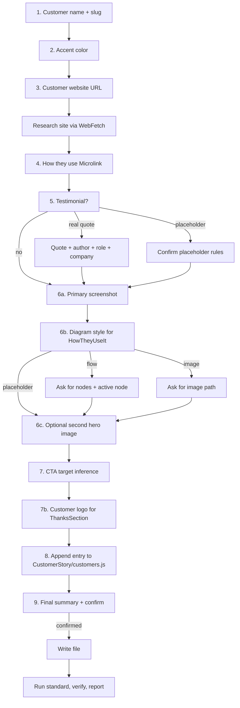

# Customer Story

Build a new customer use-case landing page at `src/pages/customers/<slug>.js`.

The goal is not generic "story" copy. The goal is a repo-native page that:

- composes shared building blocks from `src/components/patterns/CustomerStory/` (no styled-component duplication)
- swaps the default teal accent for a customer-specific accent only when the user asks
- researches the customer honestly from their website (no invented metrics, no invented features)
- automatically links the new page into the existing customer-stories carousel via the `CUSTOMERS` registry
- routes the CTA to the most relevant Microlink product page based on the use case
- closes with a customer logo + thank-you note acknowledging the customer

## Read First

Before planning or editing, read these in order:

1. `src/components/patterns/CustomerStory/index.js` — barrel export of every shared component. The customer page consumes from here.
2. `src/pages/customers/luckynote.js` — a current, fully-fleshed-out reference page. Mirror its structure.
3. `.cursor/skills/customer-story/references/template.md` — the literal template with `{{TOKEN}}` placeholders.
4. `.cursor/skills/customer-story/references/accent-colors.md` — allowed ramps and the `ACCENT` shape.
5. `.cursor/skills/customer-story/references/cta-routing.md` — use-case → product href mapping.
6. `AGENTS.md` — repo-wide style rules (`theme({...})`, design tokens, accessibility).

## Shared module

All cross-page primitives live in `src/components/patterns/CustomerStory/`. The customer page imports them by name. **Do NOT re-declare these locally.**

| Export | What it is |
|---|---|
| `CUSTOMERS` | Single registry of all customer story metadata (slug, name, blurb, icon). |
| `Section`, `SectionInner`, `BodyText`, `Caption`, `Figure`, `FigureImage` | Layout primitives (no accent dependency). |
| `SECTION_PX`, `SECTION_PY`, `SECTION_MAX_WIDTH` | Spacing constants. |
| `DashedGridOverlay` | Decorative dotted-grid background. |
| `StoryTag`, `Eyebrow` | Accent-aware chrome. Pass `accent={ACCENT}`. |
| `Testimonial` | Composed from props (`accent`, `quote`, `author`, `role`, `company`, `initials`, optional `maxWidth`). |
| `MoreCustomers` | Reads from `CUSTOMERS`, filters out `currentSlug`. Self-omits when fewer than 2 siblings remain. |
| `CtaSection` | Accent-tinted CTA panel. Looks up the RGB triplet from `accent.text`. Optional `mt` prop (default `5`). |
| `WhyCard` | One numbered card. Pass `accent`, `number`, `kicker`, `title`, `body`. |
| `FlowDiagram` | Renders boxes-and-arrows. Pass `accent` and a `nodes` array (`{ label, sub, active? }`). |

The customer page declares the `ACCENT` constant locally, then composes the inline section components (`Hero`, `AboutCustomer`, `HowTheyUseIt`, `WhyMicrolink`, `ThanksSection`) using the shared primitives. The customer page also declares a small `ThanksLogo` styled `` locally because logo `height` varies per customer.

When adding a new customer, **also add an entry to `src/components/patterns/CustomerStory/customers.js`**. The `MoreCustomers` carousel and the `/customers` index page both read from it.

## Canonical section order

Every customer page renders exactly these sections in this order:

```
Hero
AboutCustomer
  ├─ Eyebrow + Subhead
  ├─ Body paragraph 1
  ├─ Primary screenshot (between paragraphs)
  ├─ Body paragraph 2
  ├─ External link to customer website (Visit <domain>)
  └─ Testimonial card (nested inside AboutCustomer)
HowTheyUseIt
  ├─ Eyebrow + Subhead
  ├─ Body paragraph 1
  ├─ Diagram (flow / image / placeholder)
  └─ Body paragraph 2
WhyMicrolink (3 <WhyCard /> instances)
CtaSection (full-width soft accent panel — shared component)
MoreCustomers (shared component, self-renders only when ≥2 siblings exist)
ThanksSection (logo + acknowledgement; last block on the page)
```

`Testimonial` is nested at the END of `AboutCustomer`, NOT rendered as a top-level page section. `ThanksSection` is the LAST visual block on the page, AFTER `MoreCustomers`. The `MoreCustomers` carousel sits between the CTA panel and the Thanks block.

## Hard Rules

These are non-negotiable.

- Never write the file before completing all steps below and getting explicit user confirmation in the final summary step.
- Never invent customer claims, metrics, headcount, funding, scale, or product features. If the customer's website doesn't say it, ask the user.
- Never ship placeholder-only copy in `Hero`, `AboutCustomer`, `HowTheyUseIt`, `WhyMicrolink`, `CtaSection`, or `ThanksSection`. By the end, every `{{TOKEN}}` in those sections MUST be replaced with concrete content (or the corresponding section MUST be removed if the rules below allow it).
- **Testimonial placeholder is allowed under strict conditions** (see "Testimonial rules" below). Other sections are NOT allowed to ship as placeholders.
- Never use a slug of `example`, an empty slug, or a slug that already exists in `src/pages/customers/`. If the user requests a slug that collides, stop and ask.
- Never use the `pink` / `secondary` / `pinky` / `pinkest` accent — those are reserved for `src/pages/feature/*.js`. Customer pages MUST use one of the ramps in `references/accent-colors.md`.
- Never inline accent token strings (`'teal7'` etc.) outside the `ACCENT` constant. All consumers read from `ACCENT.text` / `ACCENT.bgSoft` / `ACCENT.bgEdge` / `ACCENT.highlight`.
- Never leave dead code. If the user says "no testimonial", drop the `Testimonial` import AND the `<Testimonial />` render line in `AboutCustomer`. (The styled components live in the shared module, so nothing else to remove.) `MoreCustomers` self-omits when fewer than 2 siblings remain — leave it imported and rendered.
- Never add or modify FAQ structured data. Customer pages do not have FAQ sections.
- Never run prettier, prettier-standard, or any repo-level formatter. This repo's formatter can rewrite unrelated files. Verification is `npx standard src/pages/customers/<slug>.js` (the project uses JavaScript Standard Style — see `package.json` `"lint": "standard"`). Bare `npx eslint` may pass even when `standard` reports errors, because they use different rule sets.
- Never edit `.cursor/skills/customer-story/references/*.md` as part of running the skill. Only the SKILL author maintains those.
- Hero CTA label and Bottom CTA label MUST be different strings. The Hero invites action specific to the product the customer integrated and ALWAYS follows the format `See how to integrate <product noun>` (e.g. "See how to integrate metadata", "See how to integrate screenshots", "See how to integrate PDFs"). The bottom CTA is broader and uses the action-oriented label from the cta-routing table (e.g. "Start extracting metadata", "Start capturing screenshots"). Identical labels are rejected.
- Animation rule: customer pages MUST NOT add motion/animation that ignores `prefers-reduced-motion`. The current template has no animation; if a future change adds one, it MUST honor reduced-motion or be reverted.
- The `<h1>` in `Hero` MUST set `scrollMarginTop` so deep-linking and skip-to-content land cleanly.
- Do NOT override the `<main>` landmark. `<Layout>` already wraps content in `<main id='main-content'>` and provides a Skip-to-content link.
- The `StoryTag` text is locked to `Customer story`. Do NOT change to "Case study" / "Success story" / etc. — visual consistency across customer pages.
- **External links to the customer's website MUST preserve backlink value.** Do NOT use the repo `<Link>` component for external links to the customer's site. The repo `Link` HOC unconditionally appends `rel='noopener noreferrer'` to all external links — and `noreferrer` is treated by Google as `nofollow` for SEO purposes, killing the link-equity benefit for the customer. Customer pages instead use a plain anchor: `<Text as='a' href='https://<domain>' target='_blank' rel='noopener'>`. This keeps the security benefit of `noopener` (prevents tab-nabbing) while preserving referrer + follow signals so the customer's site receives the SEO backlink. This rule applies to BOTH the About-section "Visit <domain>" link AND the ThanksSection logo/name link.

## Testimonial rules

Default: real quote from a real person at the customer.

A **placeholder testimonial** is allowed only under ALL of these conditions:

1. The user explicitly asks for a placeholder (e.g. "leave a placeholder", "I'll add the quote later").
2. The author name MUST NOT be a real, identifiable person from the customer's team. Use generic placeholders like `[Author Name]`, `[Role]`, `[Company]` — never invent words attributed to a real CTO/founder/employee.
3. The quote text is obviously placeholder copy in square brackets, e.g. `[Customer testimonial — pull-quote about why Microlink works for them.]`
4. A code comment is added directly above the `<Testimonial />` render line:

   ```jsx
   {/* TODO: replace placeholder testimonial before publishing */}
   <Testimonial />
   ```

If the user wants to attribute a real person (real name + role) but doesn't have a quote yet, the skill MUST refuse and offer two options instead: (a) wait for the real quote, or (b) draft a quote in the person's voice using only verifiable facts already on the page, marked `DRAFT — pending approval` in a code comment, to be sent to that person for sign-off before merging.

## Workflow

The skill is a strict, single-question-at-a-time conversation. Do NOT ask multi-part questions. Do NOT proceed to the next step until the current step's answer is captured.



### Step 1 — Customer name + slug

Ask: "What's the customer's name?"

After the user answers:

- Compute the default slug as `kebab-case(customer.toLowerCase())`. Strip non-alphanumeric characters except `-`. Collapse multiple dashes.
- Read `src/pages/customers/` to verify the slug is not already taken.
- If `<slug>.js` already exists OR `<slug>` is `example`, propose a different slug (e.g. `<slug>-2`) and ask the user to confirm or override.
- Echo back: "Slug will be `customers/<slug>`. Confirm or provide an alternative."

Wait for confirmation before moving on.

### Step 2 — Accent color

Ask: "What accent color? (default: teal — also available: blue, cyan, green, orange, yellow). Skip pink/red — those are reserved for feature pages."

If the user gives a brand name or hex, map it to the closest allowed ramp using `references/accent-colors.md`. If the user requests a custom hex, refuse politely (the design system requires token-backed values) and propose the closest allowed ramp.

Resolve to:

```js
const ACCENT = {
  text: '<ramp>7',
  bgSoft: '<ramp>0',
  bgEdge: '<ramp>1',
  highlight: '<ramp>5'
}
```

The `ACCENT_RGB` triplet is no longer threaded through the page — the shared `CtaSection` looks it up internally from `accent.text`. The triplet table still lives in `references/accent-colors.md` for reference and is mirrored in `src/components/patterns/CustomerStory/CtaSection.js`. **If a new accent ramp is added to `accent-colors.md`, mirror it in `CtaSection.js`.**

### Step 3 — Customer website

Ask: "What's the customer's website URL?"

After the user answers:

- Use `WebFetch` to read the homepage.
- If accessible, also `WebFetch` `/about`, `/product`, `/customers`, `/pricing` (only the ones that exist; don't 404-spam).
- Build a small notes ledger of: what they do (one line), who their users are (one line), 2–3 verifiable facts.
- Save the **domain** (e.g. `mymahi.com`, `vercel.com`) — this is `{{CUSTOMER_DOMAIN}}` and drives both the About-section external link and the ThanksSection logo path.
- Do NOT use this ledger to invent claims. It's the source for `{{ABOUT_*}}` paragraphs.
- If the site is paywalled, JS-heavy, or returns no extractable content, stop and ask the user for a 2-paragraph "about" description directly.

### Step 4 — How they use Microlink

Ask: "Briefly describe how they use Microlink. (Which products: screenshot / metadata / pdf / markdown / logo / insights? Where in their stack? What does it replace?)"

The user's answer feeds:

- `{{HOW_SUBHEAD}}` — propose one short headline. Confirm with the user before locking it.
- `{{HOW_PARA_1}}` — paragraph before the diagram, describing the integration in flowing prose.
- `{{HOW_PARA_2}}` — paragraph after the diagram, describing operational impact.
- `{{WHY_SUBHEAD}}` — short headline framing the three reasons.
- `{{WHY_LEAD}}` — lead-in paragraph.
- The three numbered cards `{{WHY_CARD_1_*}}` / `{{WHY_CARD_2_*}}` / `{{WHY_CARD_3_*}}` — propose kicker (one or two words like `Reliability`, `Performance`, `Cost`, `Stack simplicity`), title (a short sentence), and body (2–3 sentences each). Show all three together and ask the user to confirm or edit.

The keywords are also used in step 7 for CTA inference, and in the ThanksSection acknowledgement copy. Save them.

### Step 5 — Testimonial

Ask: "Do you have a testimonial / quote from someone at the customer? (yes / placeholder / no)"

**If `no`:** mark `{{TESTIMONIAL_SECTION}}` and `{{TESTIMONIAL_RENDER}}` as empty strings. The whole testimonial block is removed.

**If `placeholder`:** apply the testimonial placeholder rules above. Render the section with bracketed placeholder text and a `{/* TODO: replace placeholder testimonial before publishing */}` comment above the render line. Do NOT use a real person's name.

**If `yes`:** ask in this single message:

```
Provide:
- Quote (1–3 sentences, the exact text)
- Author name
- Role / job title
- Company (defaults to <CUSTOMER_NAME>)
```

Use straight ASCII for everything except the leading `“` smart quote (the template renders it via `<QuoteMark>` so the quote text itself does NOT include curly quotes). Trim whitespace. If the quote ends with `."`, strip the trailing quote. The quote uses the page's default sans (Inter) with `fontStyle: 'italic'` — do NOT use a serif font. The `AuthorAvatar` displays the author's initials (first letter of first + last name) in `fontFamily: 'mono'`, `color: ACCENT.text`, centered via flex; keep `aria-hidden='true'` so screen readers don't double-read the name.

### Step 6 — Visual assets

This step has three sub-questions, asked one at a time.

#### 6a. Primary screenshot (About / How sections)

Ask: "Do you have a screenshot of the customer using Microlink (a UI screenshot showing the Microlink-rendered output)? (image path / no)"

- If image path: validate the file exists at `static/<path>` (or `public/<path>`). Read its actual pixel dimensions with `sips -g pixelWidth -g pixelHeight <file>` so the `width`/`height` attributes are accurate (CLS-safe per AGENTS.md). The image is rendered between paragraphs 1 and 2 of `AboutCustomer` (canonical slot). Default `loading='lazy'`, `decoding='async'`. The styled `FigureImage` already applies `borderRadius: 3` and `boxShadow: 1`.
- If `no`: render a `FigurePlaceholder` labelled `[Screenshot of <CustomerName> using Microlink]`.

#### 6b. How-they-use diagram

Ask: "How should we visualize the integration? (flow / image / placeholder)"

- **flow** — Ask, in one message: "Provide 3–4 nodes left-to-right (e.g. `Their backend → Microlink → Target site → Their UI`). Mark which one is the highlighted Microlink node (default: the one labeled `Microlink`)." Optionally ask: "Each node may have a one-line caption — provide them or skip."

  Build the diagram block per `references/template.md` Variant A. Add the `Node`, `NodeActive`, `NodeLabel`, `NodeSub`, `Arrow` styled components ABOVE the `HowTheyUseIt` definition, after `FigurePlaceholder`. These are ported from `src/pages/feature/proxy.js` lines 484–554, with `secondary` swapped for `ACCENT.text` and `pinkest` swapped for `ACCENT.bgSoft`. Do NOT port `ResponseCard`, `ResponseLine`, or `ShieldChip` — proxy-specific.

- **image** — Ask: "Image path?". Use Variant B with `alt={{HOW_IMAGE_ALT}}` proposed from the use-case headline. Read intrinsic dimensions with `sips`.

- **placeholder** — Use Variant C with text `[<CustomerName> integration diagram]`.

#### 6c. Optional second hero image

Ask: "Do you have a wider hero/website shot of the customer's product to show above the About section? (image path / no — optional)"

- If image path: render with `maxWidth: '800px'` (override the default 600px), `loading='eager'` (LCP-friendly because it's near the top), placed as the FIRST child of `AboutCustomer`'s `SectionInner` (before the Eyebrow). Read intrinsic dimensions with `sips`.
- If `no`: skip — `AboutCustomer` starts directly with the Eyebrow.

### Step 7 — CTA target inference

Read `references/cta-routing.md` and apply the keyword table to the use-case description from step 4. First match wins.

Propose to the user, in one message:

```
CTA targets:
- Hero (specific product): <HERO_CTA_HREF> with label "See how to integrate <product noun>"
- Bottom (broad invite):   <CTA_HREF>   with label "<CTA_LABEL>"

CTA headline: "Ready to ship with <accent>Microlink</accent>?"
(or, if a single product dominates: "Ready to ship <accent>screenshots</accent>?")

Confirm or override.
```

The Hero label MUST follow the `See how to integrate <product noun>` template — the `<product noun>` is the same noun used in the bottom CTA's action label (e.g. `metadata`, `screenshots`, `PDFs`, `markdown`, `brand logos`, `performance audits`). The user MAY override either href, the headline accent word, or the bottom label. Hero label and Bottom label MUST be different strings.

If the customer uses two or more Microlink products, route the Hero CTA to the primary one and use `/pricing` for the bottom CTA. Mention the secondary product in `{{CTA_BODY}}`.

### Step 7b — Customer logo for ThanksSection

Ask: "Do you have an SVG logo for the customer at `static/images/clients/<domain>.svg`? (yes / no)"

- If `yes`: use `/images/clients/<CUSTOMER_DOMAIN>.svg` as the `ThanksLogo` source. Read its intrinsic dimensions for `width`/`height` attributes. The logo is rendered FIRST inside the ThanksSection, above the acknowledgement paragraph.
- If `no`: ask whether to (a) ship a text-only ThanksSection — render the customer name as a styled `<Link>` in the same slot the logo would occupy (still FIRST, above the paragraph) — or (b) omit the ThanksSection entirely. Default: (a) — the thank-you note is the more important part, and the slot ordering stays consistent.

### Step 8 — Add the customer to the shared registry

This runs without a user question.

Open `src/components/patterns/CustomerStory/customers.js` and append a new entry to the `CUSTOMERS` array:

```js
{
  slug: '<slug>',
  name: '<CUSTOMER_NAME>',
  blurb: '<one-line summary, ~10 words, period>',
  icon: '/images/clients/<icon-file>'
}
```

Derive the blurb from the use-case description in step 4 — keep it under ~70 characters.

The `MoreCustomers` component reads from this registry, filters out the current page (via `currentSlug` prop), and self-omits when fewer than 2 siblings remain. The `/customers` index page also reads from the same registry. Single source of truth — never duplicate the array.

If the customer's icon file isn't yet on disk at `static/images/clients/<icon-file>`, ask the user to drop it in or pick an existing fallback. Square icons sized 64–512px work best (rendered at 40×40 with `object-fit: cover`).

### Step 9 — Final summary + confirmation

Show the user a summary and stop. Do NOT write the file yet.

```
Ready to write src/pages/customers/<slug>.js:
  Customer:    <CUSTOMER_NAME>
  Domain:      <CUSTOMER_DOMAIN>
  Slug:        /customers/<slug>
  Accent:      <ramp> (text=<ramp>7, bgSoft=<ramp>0, bgEdge=<ramp>1, highlight=<ramp>5)
  Testimonial: real / placeholder / no
  Primary screenshot: yes (<path>) / no
  Diagram:     flow / image / placeholder
  Second hero image: yes (<path>) / no
  Customer logo: yes (<path>) / no (text-only thanks) / omitted
  Hero CTA:    <HERO_CTA_LABEL> → <HERO_CTA_HREF>
  Bottom CTA:  <CTA_LABEL> → <CTA_HREF>
  Registry update: append entry to CustomerStory/customers.js

Confirm to write?
```

Only after explicit "yes" / "go" / "ship it" / equivalent: substitute every `{{TOKEN}}` in `references/template.md` and write the file.

## Writing Rules

When materializing the template:

- Preserve every `theme({...})` call exactly as in the template. Do not introduce raw CSS where the template uses tokens.
- Preserve the canonical section order documented above.

### Pruning rules (only the imports change)

Because most styled components live in the shared module, the customer page is mostly a composition of imports + customer copy. Pruning is now limited to **which named imports** to take from the shared module. Only import what the page actually renders. `standard` will reject unused imports with `no-unused-vars`.

| Shared import | Drop when… |
|---|---|
| `Testimonial` | The user said "no testimonial" in step 5. |
| `FigureImage` | The page renders no `` figures (uncommon — most pages use at least one). |
| `FigurePlaceholder` | This export does NOT live in the shared module; declare it locally only when the About screenshot or How diagram is the placeholder variant. Do NOT import it. |
| `FlowDiagram` | The diagram is `image` or `placeholder` variant — no flow chart on the page. |
| `WhyCard` | NEVER drop — every customer page renders three Why cards. |
| `MoreCustomers` | NEVER drop — the component self-omits when fewer than 2 siblings exist, so it's safe to always render. |
| `CtaSection` | NEVER drop — every customer page closes with the CTA panel. |
| `BodyText`, `Section`, `SectionInner`, `Eyebrow`, `StoryTag`, `DashedGridOverlay` | NEVER drop — every customer page uses each of these. |
| `Caption` | Drop if the page's `ThanksSection` uses `BodyText` for the thank-you paragraph instead of the centered Caption. (The default template uses Caption.) |
| `Figure` | NEVER drop if any image figure renders. Drop only if both diagram and About screenshot are absent (very unusual). |

Local imports also worth pruning:

| Local import | Drop when… |
|---|---|
| `cdnUrl` import | The user replaced the `Head`'s `image` prop with a non-CDN absolute URL. Conversely, if `cdnUrl(...)` is kept anywhere, the import MUST stay. |
| `styled` import | The page declares no local styled components. (Rare — at minimum, `ThanksLogo` is local.) |

After pruning, run `npx standard src/pages/customers/<slug>.js` to catch any case the matrix missed.
- The `<h1>` in `Hero` MUST include `scrollMarginTop: 4` (or equivalent `scroll-margin-top` token) so deep-links land cleanly.
- **CtaSection (shared)** owns the accent-tinted background, border, and `mt: 5` default top-margin. Pass `mt={0}` to the shared component if the preceding `WhyMicrolink` section already carries heavy bottom padding (see `mymahi.js`'s `pb: 6` example). The accent RGB triplet is looked up internally from `accent.text` — no need to thread `ACCENT_RGB` from the page.
- **Testimonial (shared)** is nested directly inside `AboutCustomer`'s `<SectionInner>`. It does NOT render its own Section wrapper. The card's `my: [4, 4, 5, 5]` margin gives breathing room above and below; `AboutCustomer` typically sets `pb: 0` so the card carries the trailing space. If a customer's testimonial copy is long, pass `maxWidth={layout.normal}` to widen it (default is `layout.small`). The Quote is italic but uses the page default sans (Inter) — never serif.
- The About-section external link uses a plain anchor (`<Text as='a' target='_blank' rel='noopener'>`, NOT the repo `Link` component — see external-link rule above), label `Visit <CUSTOMER_DOMAIN>`, color `ACCENT.text`, `textDecoration: 'underline'`, and sits between body paragraph 2 and the Testimonial.
- The `ThanksSection` is the LAST visual block on the page, after `MoreCustomers`. The section is declared inline in the page (logo height varies). Inside it: the centered logo FIRST (wrapped in `<Text as='a' ...>` per the external-link rule above), then the acknowledgement paragraph in `<Caption>` styled with `fontSize: [0, 1]` and `<b>Thank you to the <CUSTOMER_NAME> team</b>` as the bold opening clause. The section uses `pt: 0` (the inner `Box` already pads via `pt: [3, 3, 4, 4]`).
- The `Head` `<title>` uses the format: `<CUSTOMER_NAME>: <one-line use case>`. Example: `MyMahi: rich link previews for Newsfeed posts`. This is more distinct in browser tabs and search results than `How <CUSTOMER_NAME> uses Microlink`. **Do NOT append ` · Microlink` or any brand-suffix variant to the title** — the `Meta` component automatically appends ` — Microlink` (em-dash + site name from metadata, see `src/components/elements/Meta/Meta.js` line 111: `${title} — ${name}`). Adding the brand manually duplicates it in the rendered `<title>`, Open Graph title, Twitter card, and JSON-LD. The end-user-visible result MUST be `<CUSTOMER_NAME>: <one-line use case> — Microlink` rendered by `Meta`, not authored.
- The `Head` `image` stays as `cdnUrl('banner/screenshot.jpeg')` unless the user supplies a customer-specific OG banner.
- The `Head` `image` value MUST be a fully-qualified absolute URL. The `Meta` component writes `image` directly into `og:image`, `twitter:image`, and `itemProp='image'` tags with no transformation (see `src/components/elements/Meta/Meta.js` lines 153/160/169/179). Open Graph and Twitter Card scrapers reject relative URLs and the social preview will fail. Acceptable forms: (a) `cdnUrl('path/to/asset.png')` for assets hosted on `https://cdn.microlink.io` (preferred — matches every other repo page), or (b) a literal `https://microlink.io/images/...` URL for assets in `static/images/` that haven't been uploaded to the CDN. NEVER use a bare `/images/...` relative path.

## Verification

After writing:

1. Run `npx standard src/pages/customers/<slug>.js`. (The project's lint script is `npm run lint` → `standard`. Bare `npx eslint` is NOT sufficient — `standard` enforces JavaScript Standard Style rules that bare eslint won't catch.)
2. If standard reports errors, fix them in-place. Common errors:
   - Unused imports — see the **Pruning rules** matrix above. Most `no-unused-vars` errors mean an unused import remained. Fix by removing the import, NOT by adding `// eslint-disable-next-line`.
   - Missing `key` props in any list rendering
   - Unused parameters in callback signatures
3. Re-run `standard` until clean.
4. Verify NO `{{TOKEN}}` placeholders remain in the output (grep for `{{`).
5. Verify the page composition includes (in order): `<Hero />`, `<AboutCustomer />`, `<HowTheyUseIt />`, `<WhyMicrolink />`, `<CtaSection />`, `<MoreCustomers />`, `<ThanksSection />`.
6. Verify the new entry was added to `src/components/patterns/CustomerStory/customers.js`.
6. Verify Hero CTA label ≠ Bottom CTA label.
7. Do NOT run prettier or any other formatter.

## Output Back to the User

After writing successfully, report:

- Filename: `src/pages/customers/<slug>.js`
- Route: `/customers/<slug>`
- Sections rendered (Hero, About w/ Testimonial?, How, Why, CTA, MoreCustomers?, Thanks)
- Accent color used (incl. RGB triplet)
- CTA targets (Hero + Bottom, confirmed different)
- Sibling stories linked (count + slugs)
- Anything still flagged as `[brackets]` in the file (should be zero outside an approved Testimonial placeholder)
- Suggested next steps (e.g. "add a real banner image to `Head`'s `image` prop", "supply a screenshot for the About section", "schedule a follow-up to refresh sibling carousel when a new story is added")

## Improving an Existing Customer Story

If the user asks to update an existing `src/pages/customers/<slug>.js`:

1. Read the existing file.
2. Identify which sections are present and which are placeholders.
3. Run only the steps that target the user's request (e.g. "swap the accent" → step 2 only; "add a testimonial" → step 5 only).
4. For step 8, re-run the sibling auto-detection — sibling pages may have been added since the original write.
5. Apply changes via `StrReplace`. Never rewrite the whole file unless the user explicitly asks for a full regeneration.
6. Run `npx standard src/pages/customers/<slug>.js` after edits — same verification as a fresh write (see the Verification section above).

## Final Guardrails

- Do not pretend to know what a customer does. If the website doesn't say it, ask.
- Do not ship "[Customer] does X at scale" without a verifiable source.
- Do not use the `pink/secondary` accent on a customer page, ever.
- Do not split a single customer story into multiple pages.
- Do not add a `customers/index.js` listing page as part of this skill — that is a separate task.
- Do not edit the toolbar or footer to add a `/customers` link as part of this skill.
- Do not run any formatter. Verification is `npx standard` on the single new file (see the Verification section).
- Do not attribute invented words to a real, named person from the customer's team. The placeholder testimonial rules forbid this; refuse and offer a draft-for-approval flow instead.
